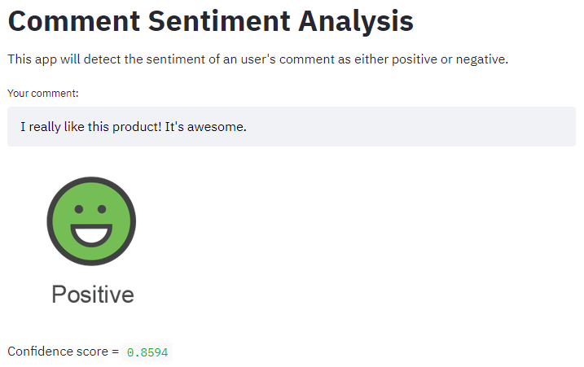

# Sentiment Analysis using Naive Bayes

## Introduction

A dataset of sample tweets is taken from the NLTK library and used to create a sentiment analysis model. The model is built using a **Naive Bayes Classifier** trained on a dataset of positive and negative tweets after preprocessing. The model takes a list of text tokens (that make up a comment) as input and predicts whether the corresponding comment is positive or negative.

Here is an screenshot of the app:

  

## Run the app
The *main.py* file is a **Streamlit** app and is deployed to [Streamlit Share](https://share.streamlit.io/). Visit the following link to run the app and test it:

#### [Comment Sentiment Analysis](https://panjek26-sentiment-analys-main-ckhwnc.streamlitapp.com/) ####

## Naive Bayes Theorem

For Example We Have dataset 10 Good Comments & 5 Negative Comments First, let's look at all the words in the good comments and negative comments and the number of occurrences as in the example below:

<ins> <b> Good Comment </b>   </ins>
“Dear” : 20 times  
“Precious” : 15 times  
“Donation” : 1 times  
“Love” : 15 times  
“Hangout” : 3 times  

<ins> <b> Negative Comment </b>   </ins>
“Dear” : 2 times  
“Bad” : 2 times  
“Donation” : 15 times  
“Worst” : 1 times  
“Hangout”: 0 times  

From the dataset above, let's say likelihood (the probability in discrete data is called likelihood) occurrence of each word as follows:

<ins> <b> Good Comment </b>   </ins>
p(Dear|Normal) : 20/54 = 0.37  
p(Precious|Normal) : 15/54 = 0.277  
p(Donation|Normal) : 1/54 = 0.0185  
p(Love|Normal) : 15/54 = 0.277  
p(Hangout|Normal) : 3/54 = 0.055  

<ins> <b> Negative Comment </b>   </ins>
p(Dear|Negative): 2/20 = 0.1   
p(Bad|Negative): 2/20 =0.1   
p(Donation|Negative): 15/20 = 0.75   
p(Worst|Negative): 1/20 = 0.05   
p(Hangout|Negative) : 0/20 = 0   

We already have the likelihood for the occurrence of each word in the Good and Negative Comments. Then we also have a chance in general Comment appears as Good or Negative, we call the prior probability.  

p(G) = (summary good comment)/(summary good comment + summary negative comment)   
p(G) = 10/(10+5) = 0.667   

p(N) = 5/(5+10) = 0.333   
